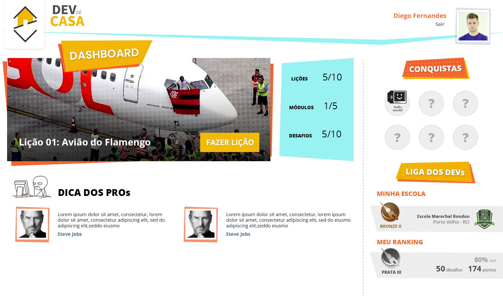
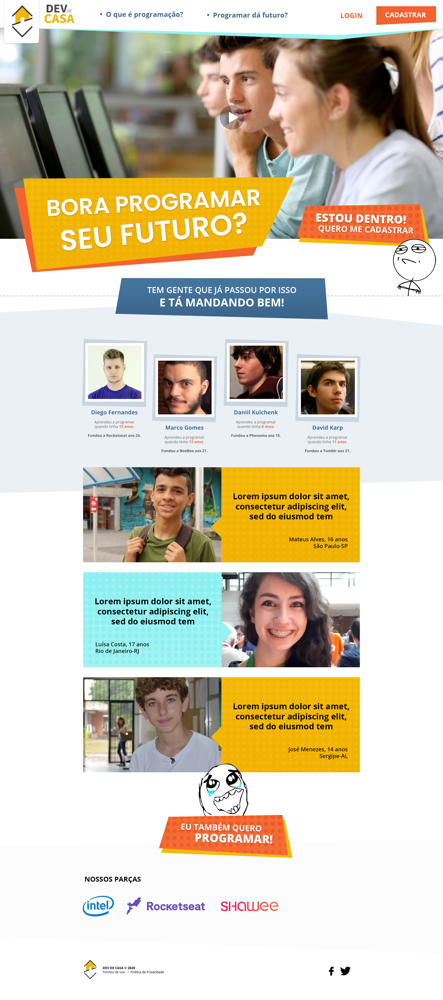

# DEV de Casa - Hackathon RS/XP

A plataforma vai reunir ensino de programação para jovens e adolescentes do ensino médio com o objetivo de desmistificar e conscientizar a população para a carreira de tecnologia. E também servir de insumo para o dialogo do jovem com seus pais e/ou responsáveis com o objetivo de ampliar seus horizontes para cursos de Tecnologia como uma carreira de vida promissora.

As lições e desafios serão apresentados na linguagem dos adolescentes, usando temas e exemplos que sejam interessantes e não fique com cara de mais uma aula da escola.
Temas como: Futebol, Memes, Games etc.

Plataforma de ensino:

- Ensino dos pilares da programação, lógica e pensamento estruturado, através de Block Programming.
- Os Usuários de destaque (que mais participam, concluem as lições) serão divulgados para empresas parceiras oferecerem "estagios" ou "intercambios/imerssão" para os usuarios vejam como é o dia a dia de uma empresa de tecnologia.

Artigos:

- Apresentar conteúdos de outros jovens que já tiveram experiencia tanto em empresas ou individualmente.

Exemplo:

- Futuro e salarios atuais do mercado
- Como criar apps tendo 14 anos, sem precisar de empresas?
- Introducao ao empreendorismo na tecnologia
- Apresentacao de conteudo "patrocinado" por empresas (Hotmart, Rocketseat etc)

Área para escolas e instituicoes de ensino:

- Permitir adaptacoes das lições/conteudos de ensino tecnico para temáticas de interesse das escolas/séries dos alunos
- Realização de eventos/hackatons estudantis anuais onde as escolas e equipes premiadas ganharão prêmios oferecidos pelos parceiros. Hackaton powered by SHAWEE

## Fotos do Projeto

## Links

- [GitHub](https://github.com/juanpetterson/hackaton-rsxp)
- [Figma](https://www.figma.com/file/kAkyFEUL4KnCadcWmDrMyN/Hackathon-RSXP)
- [Zeplin](https://app.zeplin.io/project/5dde66bf1b73d7a6f1b03936)

## Pápeis da equipe

- Em geral todos participam do progresso da criação e elaboração da ideia, colaborando uns com outros na protipação, desenvolvimento e aprimorando do projeto

- João inicialmente ajudou na prototipação do Wirefame no Figma, após isso ele ajudou no desenvolvimento da aplicação.
- Marcilio começou fazendo o esboço das telas, fez a criação do layout e ajudou no desenvolvimento da aplicação.
- Juan iniciou o projeto com as configurações e desenvolveu a aplicação.
- Francisco ajudou na parte dos dados para alimentar a aplicação e ajudou a desenvolver a aplicação.

## Integrantes

- [João Benthin](https://www.linkedin.com/in/joaobenthin)
- [Marcilio Bezerra](https://www.linkedin.com/in/marciliocb)
- [Juan Petterson Heberle](https://www.linkedin.com/in/juan-petterson-heberle-795a44177)
- [Francisco Junior](https://www.linkedin.com/in/j%C3%BAnior-soares-64b51464)
